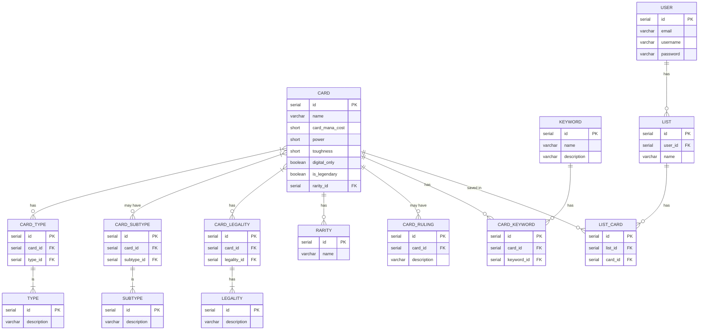

# mtg-card-search

## What is the application?
an application that will query a database for magic the gathering card details

Magic the Gathering (MTG) is a trading card game that was created in 1993. The game has over 30 million players world wide and with over 23 thousand cards created.

There are multiple websites and websites for finding cards, however I have not found any capable of handling spelling mistakes. How is anyone meant to be able to type this correctly "Zndrsplt, Eye of Wisdom"

Another issue is that I have not yet encountered an offline application where you can query for a card and be informed of what all of the keywords on a card mean. Take the following card for example: https://scryfall.com/card/sld/490/mikaeus-the-unhallowed. A new player would not understand:
* intimidate: This creature can’t be blocked except by artifact creatures and/or creatures that share a color with it.
* undying: When a creature with undying dies, if it had no +1/+1 counters on it, return it to the battlefield under its owner’s control with a +1/+1 counter on it.


Phase 1: 
* smart search to allow for incomplete/mispelled card names
* login/registering of users
* keyword dictonary eg. `intimidate: This creature can’t be blocked except by artifact creatures and/or creatures that share a color with it.`

* the ability to save cards to collections for future reference (like spotify playlists)

Phase 2:
* create an offline DB of all english MTG cards printed. This should be synced on a regular basis (at least weekly)
* advanced search - basically this on mobile but with some flexibility with spelling. https://scryfall.com/advanced
* support for reprints of cards (in phase 1 we will only handle the most recent reprint)

Phase 3:
* price alerts for cards - user can set a price they're willing to pay for a card and get a push notification if the price drops to a price they're willing to pay.

Optional but I think it'd be cool:
* other language support
* implementing google firebase for translation of cards by taking photos. It's not uncommon for players to buy cards in other languages because they're cheaper. It would be nice to be able to get the english text for a Japanese/Chinese/French/Italian/German/Spanish/Portuguese card

## Domain Model


# Entity Relationship Diagram


# API Specification

`POST /users`
Create a user

Request
```json
{
  "email": "linda.fenton@email.com",
  "password": "password123"
}
```
Response - `201`
```json
{
  "email": "linda.fenton@email.com",
  "id": "1"
  "accessToken": "bearer ???"
}
```
---

`Patch /users`
Update a user

Request
```json
{
  "email": "linda.fenton@email.com",
  "username": "big_cheddar",
  "password": "password123"
}
```
Response - `200`
```json
{
  "email": "linda.fenton@email.com",
  "id": "1"
  "username": "big_cheddar"
}
```
---

`DELETE /users/{user_id}`
Delete a user by id

Response - `204 No Content`

---

`POST /users/login`
Login user
Request
```json
{
  "email": "linda.fenton@email.com",
  "password": "password123"
}
```

Response 200
```json
{
  "email": "linda.fenton@email.com",
  "id": "1"
  "username": "big_cheddar",
  "accessToken": "bearer ???"
}
```

---

`GET /cards?searchTerm={searchTerm}`
Search for a card 

Response - `200`
```json
{
  "id": "1"
  "name": "Derevi, Empyrial Tactician",
  "manaCost": "GreenWhiteBlue",
  "power": "2",
  "toughness": "3",
  "text": "Flying/nWhenever Derevi, Empyrial Tactician enters the battlefield or a creature you control deals combat damage to a player, you may tap or untap target permanent."
  "username": "big_cheddar",
  "types": ["Creature"],
  "subtypes": ["Legendary", "Bird", "Wizard"],
  "rarity": "Mythic Rare"
  "legalFormats": ["Legacy", "Vintage", "Commander", "Oathbreaker"]
}
```

---

`POST /lists`
Create a list

Request
```json
{
  "name": "favs",
  "userId": "1"
}
```
Response - `201`
```json
{
  "id": "1"
  "name": "favs",
  "userId": "1"
}
```
---

`Patch /lists`
Update a list

Request
```json
{
  "name": "favs",
  "id": "1",
}
```
Response - `200`
```json
{
  "id": "1"
  "name": "favs",
  "userId": "1"
}
```
---

`DELETE /lists/{id}`
Delete a list by id

Response - `204 No Content`

---

`POST /saved-cards`
Save card to a list

Request
```json
{
  "listId": "1",
  "cardId": "1"
}
```
Response - `201 Created`

---

`DELETE /saved-cards?listId={listId}&cardId={cardId}`
Remove a saved card from a list

Response - `204 No Content`

---

# Get started:
run `docker compose up`
