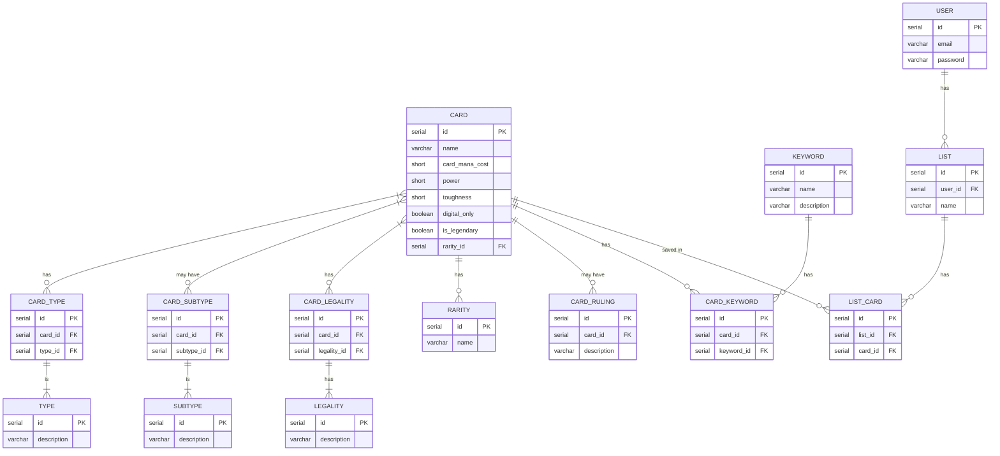

```mermaid

erDiagram
    CARD }|--o{ CARD_TYPE : has
    CARD }|--o{ CARD_SUBTYPE : "may have"
    CARD }|--o{ CARD_LEGALITY : has
    CARD ||--o{ RARITY : has
    CARD_TYPE ||--|{ TYPE : is
    CARD_LEGALITY ||--|{ LEGALITY : has
    CARD_SUBTYPE ||--|{ SUBTYPE : is
    CARD ||--o{ CARD_RULING : "may have"
    CARD ||--o{ CARD_KEYWORD : has
    KEYWORD ||--o{ CARD_KEYWORD : has

    USER ||--o{ LIST : has
    LIST ||--o{ LIST_CARD : has
    CARD ||--o{ LIST_CARD : "saved in"


CARD { 
    serial id PK
    varchar name
    short card_mana_cost
    short power
    short toughness
    boolean digital_only
    boolean is_legendary
    serial rarity_id FK
}
TYPE { 
    serial id PK
    varchar description
}

LEGALITY { 
    serial id PK
    varchar description
}

SUBTYPE { 
    serial id PK
    varchar description
}
RARITY { 
    serial id PK
    varchar name
}
CARD_TYPE {
    serial id PK
    serial card_id FK
    serial type_id FK
}
CARD_SUBTYPE {
    serial id PK
    serial card_id FK
    serial subtype_id FK
}
CARD_LEGALITY {
    serial id PK
    serial card_id FK
    serial legality_id FK
}

CARD_RULING { 
    serial id PK
    serial card_id FK
    varchar description
}
KEYWORD { 
    serial id PK
    varchar name
    varchar description
}

CARD_KEYWORD { 
    serial id PK
    serial card_id FK
    serial keyword_id FK
}
USER { 
    serial id PK
    varchar email
    varchar password
}
LIST { 
    serial id PK
    serial user_id FK
    varchar name
}
LIST_CARD { 
    serial id PK
    serial list_id FK
    serial card_id FK
}
```